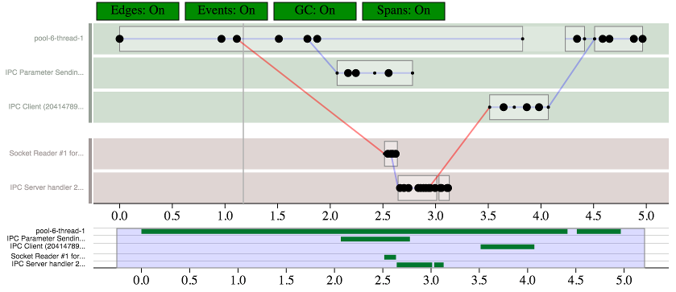
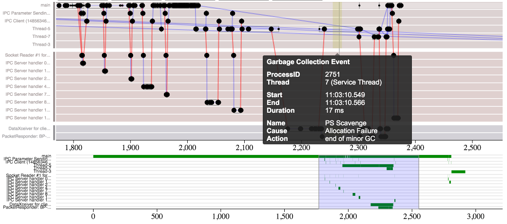
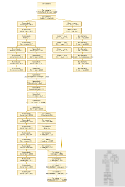
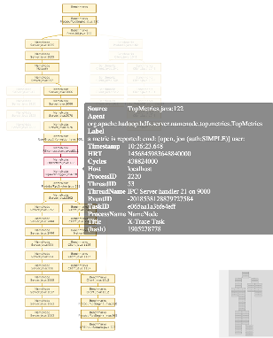
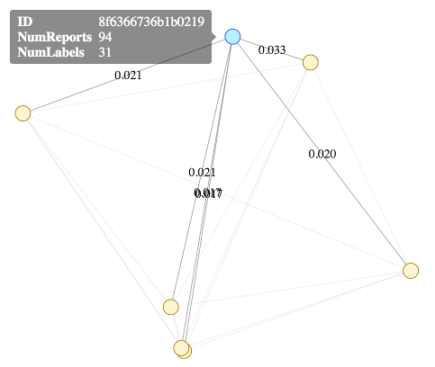

## XTrace - WebUI Graph Visualizations

The visualization package contains several web-based visualizations of X-Trace tasks.  They are mostly written using D3.  They can be accessed through the X-Trace web UI, usually at http://localhost:4080

#### SwimLane

This visualization draws the X-Trace reports as a swimlane, with time going from left to right.  Each dot is one X-Trace report.  Each row is one thread in one process.  Threads of the same process are color coded.  Rows are labelled on the left with the thread names.  Lines are drawn between dots if there is a direct causal relation between them (eg, if report A was generated followed by report B, a line will be drawn from A to B).  Hovering over a node will show the X-Trace report details.  Click <a href="http://cs.brown.edu/~jcmace/xtrace_viz/swimlane.html?id=e065aa1a3bfe4eff.json" target="_blank">here</a> for a live visualization.

If Retro is also [configured to log X-Trace reports](../../docs/retro/retrowithxtrace.html) when resources are consumed, the swimlane graph will have additional highlights for garbage collection, disk events, and network events.

#### Animated

This visualization draws the X-Trace reports as a directed, acyclic graph, with causality going top to bottom.  Each node of the graph is one X-Trace report. The visualization is interactive -- hovering over a node will show the X-Trace report details and highlight the causal path in the graph.  A right-click context menu allows you to manually hide nodes and select paths in the graph.  Click <a href="http://cs.brown.edu/~jcmace/xtrace_viz/graph.html?id=e065aa1a3bfe4eff.json" target="_blank">here</a> for a live visualization.

The "Lite" graph is the same as the Animated graph, but lacks animations, making it a better choice for large graphs that might be slow to render.  Click <a href="http://cs.brown.edu/~jcmace/xtrace_viz/graph.html?lightweight=true&id=e065aa1a3bfe4eff.json" target="_blank">here</a> for a live visualization.

#### Comparison

From the X-Trace dashboard, there are some tools for comparing multiple graphs

* **Select Related** will select all other tasks that overlap in time with the selected requests.
* **Swimlane Selected** will display a swimlane visualization of all selected requests.  The following example compares two executions of `hdfs dfs -copyFromLocal file` for two different files: <a href="http://cs.brown.edu/people/jcmace/xtrace_viz/swimlane.html?id=2994b4e13190410d.json,37a89927d7754f9f.json" target="_blank">example</a>.

#### Graph Kernels

**Side-by-side Comparinson** will compare two of the animated execution graphs.  It will run a [Weisfeiler-Lehman Graph Kernel](http://www.jmlr.org/papers/volume12/shervashidze11a/shervashidze11a.pdf) to compare the two execution graphs, and highlight the nodes in the respectve graphs based on how "different" they are.  The following example compares two executions of `hdfs dfs -copyFromLocal file` for a small file and a large file, highlighting where they differ.  One file is bigger than the other, so they differ at the part of the execution that transfers data. Click <a href="http://cs.brown.edu/people/jcmace/xtrace_viz/compare.html?id=2994b4e13190410d.json,37a89927d7754f9f.json" target="_blank">here</a> for a live visualization.

**Cluster Selected** will calculate the pairwise differences between all selected graphs, and show a force-directed graph based on the differences.  The more different two graphs are, the further away they will be.  Click <a href="http://cs.brown.edu/people/jcmace/xtrace_viz/cluster.html?id=2994b4e13190410d.json,37a89927d7754f9f.json,eaf53bb919d745c5.json,8f6366736b1b0219.json,244c5f59847edab7.json,4a660e3767f85f82.json,c68bf965678abbfa.json" target="_blank">here</a> for a live visualization.

